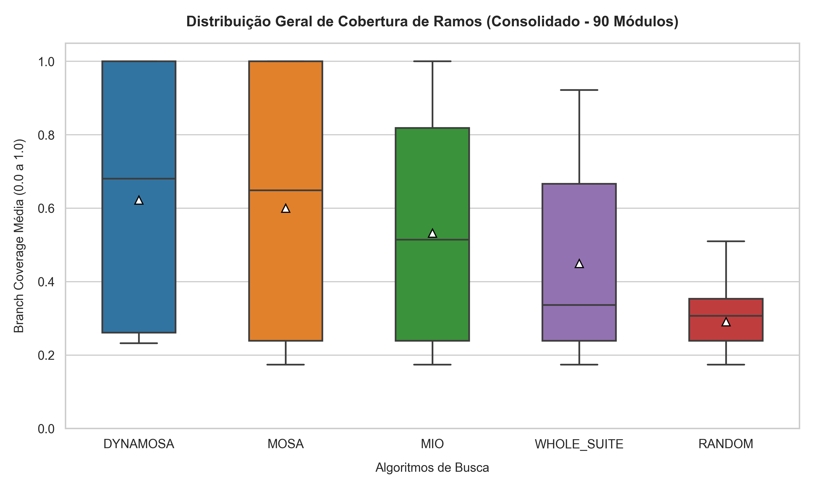

# Apresentação de Slides:

Link para a apresentação: https://docs.google.com/presentation/d/1quWzqdb0tpzzbKynGRfhMFbWANKof9JZmhBoxkCkgx0/edit?slide=id.g3ec1ec978cb_1_287#slide=id.g3ec1ec978cb_1_287

# Replicação do Framework Pynguin

Este repositório contém o arcabouço metodológico, scripts de automação e todos os dados resultantes da replicação empírica do framework **Pynguin** para Teste de Software Baseado em Busca (SBST). O objetivo é avaliar a eficácia dos algoritmos **DynaMOSA, MOSA, MIO, Whole Suite e Random** sob pressão paramétrica escalável.

---

## 📊 Visão Geral do Experimento
O benchmark foi expandido para cobrir **3 domínios distintos de complexidade**, totalizando **90 módulos lógicos** avaliados ao longo de **1350 rodadas de execução** (3 repetições de 300 segundos por algoritmo/módulo):

1. **Domínio Numérico (`TheAlgorithms`):** 30 módulos focados em estruturas matemáticas complexas.
2. **Domínio Textual (`Validators`):** 30 módulos focados em validações booleanas e manipulação de strings.
3. **Domínio de Ordenação (`Sorting Algorithms`):** 30 módulos contendo algoritmos de ordenação tradicionais com restrições paramétricas crescentes.

---

## 📂 Estrutura de Artefatos Entregues

* **`resultados_experimento_total.csv`**: Arquivo mestre unificado localizado na raiz, contendo a consolidação estatística de todas as 1350 rodadas para auditoria rápida.
* **`boxplot_consolidado_90_modulos.png`**: Gráfico boxplot global integrando a distribuição de cobertura de ramos (Branch Coverage) de todo o benchmark.
* **`resultados.zip`**: Histórico completo contendo os relatórios brutos em formato XML e as suítes de testes geradas pelo Pynguin para as 1350 rodadas (compactado devido ao volume massivo de logs lógicos).
* **`/dataset` e `/scripts`**: Diretórios contendo os 90 códigos-fonte criados e os scripts em Python/PowerShell desenvolvidos para automação dos testes e mineração dos dados.

---

## 📈 Resumo Estatístico do Experimento (Resultados Globais)

### 1. Domínio Numérico (TheAlgorithms)
* **Comportamento:** **DynaMOSA (98.1%)** e **MOSA (97.0%)** lideraram com folga. 
* **Análise:** A forte orientação matemática e o cálculo contínuo de distância de ramos (*branch distance*) permitiram que os algoritmos genéticos moldassem os dados com precisão, enquanto o **MIO (83.9%)** sofreu com a dispersão estrutural do espaço de busca.

### 2. Domínio Textual (Validators)
* **Comportamento:** Colapso generalizado das meta-heurísticas de busca (**DynaMOSA 26.3%** vs **Random 21.7%**).
* **Análise:** Como validações de strings geram retornos booleanos puros, os algoritmos genéticos não recebem pistas de aproximação, transformando a busca guiada em busca cega (equivalente à força bruta).

### 3. Domínio de Ordenação (Sorting)
* **Comportamento:** Saturação precoce nos módulos iniciais com divergência estatística clara a partir do módulo 8 (**Algoritmos de Busca ~91.3%** vs **Random ~78.2%**).
* **Análise:** Em cenários de baixa complexidade paramétrica e caminhos altamente lineares, o tempo de 300 segundos permitiu o esgotamento do espaço de busca mesmo por amostragem puramente aleatória. No entanto, o aumento incremental do tamanho dos arrays e restrições lógicas nos módulos avançados evidenciou a superioridade e resiliência dos algoritmos guiados por *fitness*.

---

## 🗺️ Análise Visual Consolidada

O gráfico abaixo apresenta a distribuição estatística de cobertura de ramos alcançada por cada meta-heurística ao longo dos 90 módulos integrados do benchmark, destacando a resiliência das abordagens guiadas por aptidão frente à busca cega (*Random*).

